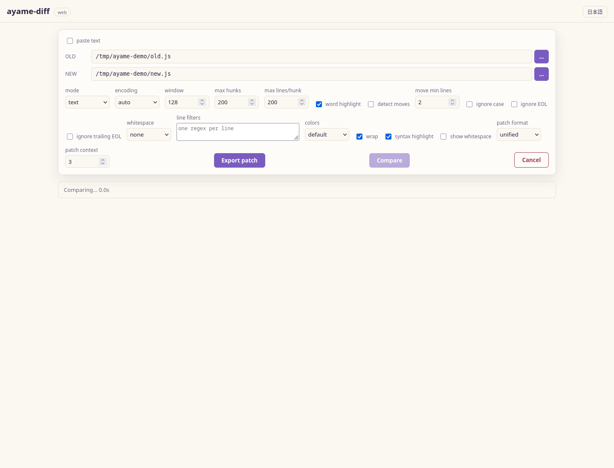

<!-- i18n: language-switcher -->
[English](README.md) | [日本語](README.ja.md)

# ayame-diff

[](https://github.com/hjosugi/ayame-diff/actions/workflows/build.yml)
[](LICENSE)

A native CLI tool for comparing huge CSV/TSV files with different row orders and outputting the difference rows as TSV.

Designed for files with up to 5,000,000,000 rows, it does not load all rows into memory. Input is split by key hash, each partition is sorted using memory-limited external merge sort, and then compared in parallel by multiple workers.

## GUI preview

[](docs/assets/screenshot-diff.png)

The embedded local GUI also supports [folder comparison](docs/assets/screenshot-folder.png),
[three-way merge](docs/assets/screenshot-three-way.png), and a configurable
[comparison setup](docs/assets/screenshot-setup.png). See the [GUI guide](docs/gui.md).

## Why the GUI stays local

The browser is the UI, not the execution sandbox: the native ayame-diff process
keeps direct path access, file-change watching, disk-backed external sorting,
and the same comparison engine as the CLI.

| Local ayame-diff process | Browser-only deployment boundary |
|---|---|
| Watches file-backed comparisons after external saves | No portable watcher for arbitrary changes outside the page |
| Spills huge CSV/TSV work to `--temp-dir` under a memory budget | Browser memory and managed-storage quotas apply |
| Supports CLI, file-manager, and custom Git tool workflows | Integration depends on browser- and OS-specific hand-offs |

Browser APIs can cover parts of this boundary after user permission, so this is
not a claim that WebAssembly is categorically incapable. See
[why the local-server architecture is intentional](docs/design.md) and
[file-manager and Git integration](docs/shell-integration.md).

## Main Features

- CSV/TSV key comparison (`csv`), text line diff (`text`), and sorted comparison (`sorted`)
- Automatic character encoding detection (UTF-8 / UTF-16 / Shift_JIS / EUC-JP / ISO-2022-JP), explicit specification via `--encoding`
- Supports CSV, TSV, `.csv.gz`, `.tsv.gz`
- Supports combinations with different formats on left and right
- If no key specified, compares using all columns as key
- Specify multiple header names or column numbers as keys
- Specify columns to exclude from all-column key with `--exclude-key` / `--exclude-key-index`
- Can compare even if row order differs between left and right
- Automatically aligns columns if header names match, even if column order differs
- Strict comparison of duplicate keys as multisets of rows
- CSV cell-level diff (`_changed_cols` / JSON Lines), numeric tolerance, per-column change ranking
- Web GUI for header inspection, searchable key column selection, analysis/performance settings, cell highlighting, full result export
- Folder comparison with metadata expressions, reusable filter sets, five comparison methods, and previewable GUI filters
- Supports RFC 4180-style CSV/TSV with quotes, commas, tabs, and newlines
- Fast parallel parser for simple TSV/CSV
- Memory-limited external sort
- Parallel comparison by hash partition
- gzip input/output
- Cross-buildable single binary for Linux / macOS / Windows
- No external database, CGO, or external Go modules required

## Installation

If you want to use it without installing Go, Python, WSL, etc., download the archive matching your OS and CPU from [GitHub Releases](https://github.com/hjosugi/ayame-diff/releases/latest).

- Windows x64 / ARM64: `ayame-diff-<version>-windows.zip`
- Linux x64 / ARM64: `ayame-diff-<version>-linux-<arch>.tar.gz`
- macOS Intel / Apple Silicon: `ayame-diff-<version>-darwin-<arch>.tar.gz`

If you have Go 1.23 or later, you can install directly from source.

```bash
go install github.com/hjosugi/ayame-diff/cmd/ayame-diff@latest
```

You can verify file integrity using the `SHA256SUMS` file in the same Release as the downloaded archive.

## Subcommands

```
ayame-diff csv    [flags] --left A --right B --out D   # CSV/TSV key comparison (default)
ayame-diff text   [flags] LEFT RIGHT                      # Text line diff
ayame-diff sorted [flags] LEFT RIGHT                      # Sort then line diff
ayame-diff dir    [flags] LEFT RIGHT                      # Recursive folder/archive (zip, tar.gz) comparison
ayame-diff bin    [flags] LEFT RIGHT                      # Binary/hex diff
ayame-diff 3way   [text|csv] [flags]                   # BASE / LEFT / RIGHT three-way comparison
ayame-diff serve  [--addr host:port] [--allow-remote]  # Browser GUI (local web)
ayame-diff gui    [--addr host:port] [--allow-remote] [--no-open]
ayame-diff shell-install                               # Register file-manager integration
ayame-diff shell-uninstall                             # Remove file-manager integration
ayame-diff update [--check]                            # Self-update to latest release (SHA256 verification)
ayame-diff remove [--yes]                              # Uninstall standalone version
ayame-diff shell-select PATH                           # Handle a Windows Explorer selection (internal helper)
```

If you start with `--left ... --right ...` without a subcommand, it works as `csv` (backward compatible).
Two bare paths (`ayame-diff A B`) automatically select text or folder mode.
`ayame-diff --gui A B` opens the GUI and starts the comparison immediately.
Enable two-item drag-and-drop and Explorer / Finder / Linux file-manager
integration with `ayame-diff shell-install` (remove it with `shell-uninstall`).

### `text` — Line Diff

Compares two text files (supports `.gz`) line by line. Uses bounded resync window method for linear and memory-bounded processing even with huge files.

```bash
ayame-diff text old.txt new.txt                 # unified (default)
ayame-diff text --side-by-side old.txt new.txt  # 2-column display
ayame-diff text --json old.txt new.txt          # machine-readable JSON
ayame-diff text --summary old.txt new.txt       # summary (1 line only)
ayame-diff text --normal old.txt new.txt        # GNU normal-diff (patch)
ayame-diff text --format unified -U 3 old.txt new.txt > change.patch
ayame-diff text --format context -C 3 old.txt new.txt > change.patch
ayame-diff text --detect-moves old.txt new.txt   # match moved blocks
ayame-diff text --sync 100:120 old.txt new.txt   # manually specify matching lines
ayame-diff text --html report.html old.txt new.txt  # self-contained HTML report
ayame-diff text --pre "jq -S ." a.json b.json   # prediffer (preprocess then diff)
ayame-diff text --encoding shift_jis a.txt b.txt  # specify encoding (default auto)
```

Shift_JIS / EUC-JP / UTF-16 / ISO-2022-JP are auto-detected (BOM prioritized, then heuristic). If misdetected, override with `--encoding`.

WinMerge-style comparison options are also available (only normalizes for comparison, output remains original lines):

```bash
ayame-diff text --ignore-case a.txt b.txt              # ignore case
ayame-diff text --ignore-whitespace change a.txt b.txt # compress consecutive spaces to 1, trim ends
ayame-diff text --ignore-whitespace all a.txt b.txt    # ignore all whitespace
ayame-diff text --ignore-eol a.txt b.txt               # ignore CRLF/LF differences
ayame-diff text --ignore-trailing-eol a.txt b.txt      # ignore only presence/absence of trailing newline
ayame-diff text --filter-line 'timestamp=\S+' a.log b.log # exclude variable parts by regex
```

For CSV, the same normalization can be applied to keys and values, supports column exclusion from value comparison and numeric tolerance.

```bash
ayame-diff csv --left a.csv --right b.csv --key id \
  --ignore-column updated_at --tolerance 0.0001 --out diff.tsv
ayame-diff csv --left a.csv --right b.csv \
  --column-tolerance price=0.01 --out diff.tsv
ayame-diff csv --left a.csv --right b.csv --key id \
  --cell-diff --out cells.tsv       # _changed_cols and per-column ranking
ayame-diff csv --left a.csv --right b.csv --key id \
  --json --out cells.jsonl          # structured output of left/right cell values
ayame-diff csv --project jobs/daily.ayamediff.json --diff-exit-code
```

Adjust output amount and resync window with `--max-hunks` / `--max-lines` / `--window` / `--width`. With `--word`, only changed words in modified lines are highlighted with `[-deleted-]` / `{+added+}` markers.

### `sorted` — Sorted Comparison

For files with same content but different row order, sorts both sides by line then compares. Supports `--numeric` / `-n`, `--reverse` / `-r` (v1 uses in-memory sort, external sort is #7).

```bash
ayame-diff sorted old.txt new.txt
ayame-diff sorted --numeric metrics-a.txt metrics-b.txt
```

### `serve` — Browser GUI

Starts a local web app to compare two files in the browser. Binds to localhost by default (since it opens the entered path directly, for local use only).
Every run generates an API token that the printed URL carries; the API refuses
calls without it, and a loopback server also pins the `Host` header, so a
website you happen to be visiting cannot drive it. Non-loopback addresses are
rejected unless you pass `--allow-remote`; remote mode exposes APIs that can
read and write local files to anyone holding the URL, so use it only behind
trusted network access controls.

```bash
ayame-diff serve                       # http://127.0.0.1:8080
ayame-diff serve --addr 127.0.0.1:9000
ayame-diff serve --addr 0.0.0.0:8080 --allow-remote
```

Specify paths for LEFT / RIGHT and `text` / `sorted` mode/options, then Compare to display differences in a side-by-side grid with header, row numbers, and word-level highlights for each hunk.

## How to Choose Keys

There are three modes for specifying keys:

1. No option: use all columns as key
2. `--key` / `--key-index`: specify columns to include as key
3. `--exclude-key` / `--exclude-key-index`: specify columns to exclude from all-column key

Include and exclude specifications can be mixed.

### Default: Use All Columns as Key

If you omit key options, all columns are used as key for multiset row difference.

```powershell
.\ayame-diff.exe `
  --left "D:\data\old.tsv" `
  --right "D:\data\new.csv" `
  --out "D:\data\diff.tsv"
```

Since all columns are keys, any row with a difference in any column becomes `LEFT_ONLY` or `RIGHT_ONLY`. In all-column key mode, the same row is not doubly saved as key and row data; it is saved only once in temporary files.

### Specify Only Columns to Exclude from Key

For example, to use all columns except `updated_at` and `checksum` as key. Excluded columns remain in full row comparison and diff output. If only excluded columns differ for the same remaining key, left and right rows are output as `CHANGED`.

```powershell
.\ayame-diff.exe `
  --left "D:\data\old.tsv" `
  --right "D:\data\new.tsv" `
  --exclude-key updated_at `
  --exclude-key checksum `
  --out "D:\data\diff.tsv"
```

To exclude by column number:

```powershell
.\ayame-diff.exe `
  --left "D:\data\old.tsv" `
  --right "D:\data\new.tsv" `
  --exclude-key-index 3 `
  --exclude-key-index 7 `
  --out "D:\data\diff.tsv"
```

### Specify Columns to Include as Key

Specify multiple header names:

```bash
ayame-diff \
  --left old.tsv \
  --right new.csv \
  --key customer_id \
  --key event_date \
  --out diff.tsv
```

To specify multiple column numbers (default is 0-based):

```bash
ayame-diff \
  --left old.tsv \
  --right new.tsv \
  --key-index 0 \
  --key-index 3 \
  --out diff.tsv
```

To use 1-based indexing:

```bash
ayame-diff \
  --left old.csv \
  --right new.csv \
  --key-index 1 \
  --key-index 4 \
  --index-base 1 \
  --out diff.tsv
```

If there is no header:

```bash
ayame-diff \
  --left old.tsv \
  --right new.tsv \
  --header=false \
  --key-index 0 \
  --key-index 2 \
  --out diff.tsv
```

gzip output is enabled by extension:

```bash
ayame-diff --left old.csv.gz --right new.tsv.gz --key id --out diff.tsv.gz
```

## Windows Native Execution

The `ayame-diff.exe` in the distributed ZIP is a native console EXE for Windows x64. No need to install Go, Python, WSL, Java, or external DLLs.

PowerShell:

```powershell
.\ayame-diff.exe --version
.\ayame-diff.exe --help
```

Command Prompt:

```bat
ayame-diff.exe --version
ayame-diff.exe --help
```

On ARM64 Windows, use `arm64\ayame-diff.exe`. The binary is built with `CGO_ENABLED=0`. Since it is not code-signed, Windows may show a warning on first run depending on your environment.

## Diff Output

Output is always TSV. `_diff` and `_side` are added at the start, followed by all original columns in left input order.

```text
_diff	_side	id	name	amount
LEFT_ONLY	left	10	Alice	100
RIGHT_ONLY	right	20	Bob	200
CHANGED	left	30	Carol	300
CHANGED	right	30	Carol	350
```

| `_diff` | `_side` | Meaning |
|---|---|---|
| `LEFT_ONLY` | `left` | Key exists only on left side |
| `RIGHT_ONLY` | `right` | Key exists only on right side |
| `CHANGED` | `left` | Key exists on both sides, unmatched left row |
| `CHANGED` | `right` | Key exists on both sides, unmatched right row |

Rows with identical keys and content are matched one by one. For example, if left has 3 identical key/row, right has 2, 2 are matched, remaining left 1 is `CHANGED`.

In default all-column key mode, identical keys are identical rows, so usually diff rows are `LEFT_ONLY` / `RIGHT_ONLY` rather than `CHANGED`. If you want to pair before/after rows by the same key, specify an identifier column with `--key` or exclude changeable columns with `--exclude-key`.

Output order is by hash partition and key order, not input order or global key order. Use as a diff set.

## CSV / TSV Parser

### `auto`

- CSV: `rfc4180`
- TSV: `simple`

### `simple`

A fast parser that does not interpret quotes. For uncompressed normal files, reads in parallel by splitting file ranges.

Suitable for data meeting these conditions:

- No delimiter inside fields
- No newline inside fields
- No need for quote escaping

Can speed up CSV without quotes.

```bash
ayame-diff \
  --left old.csv --right new.csv \
  --left-parser simple --right-parser simple \
  --key id --out diff.tsv
```

### `rfc4180`

Handles fields with quotes, delimiters, and newlines. For TSV with quoted tabs or newlines, specify explicitly.

```bash
ayame-diff \
  --left old.tsv --right new.tsv \
  --left-parser rfc4180 --right-parser rfc4180 \
  --key id --out diff.tsv
```

Use `--lazy-quotes` only if you need to tolerate invalid quotes.

## If Column Order Differs Between Left and Right

With default `--align-columns-by-name=true`, if header names are unique and the same set, right side is reordered to match left column order for comparison.

```text
left:  id,name,amount
right: amount,id,name
```

This combination can be compared. If header names are duplicated, it becomes ambiguous and results in error.

To require exact column order match:

```bash
--align-columns-by-name=false
```

## Recommended Settings for 5,000,000,000 Rows

Optimal values depend on average row length, key distribution, CPU count, NVMe bandwidth, free disk space, and file descriptor limit. Measure with tens of millions of real data first.

```bash
ayame-diff \
  --left /data/old.tsv \
  --right /data/new.tsv \
  --key tenant_id \
  --key record_id \
  --out /data/diff.tsv.gz \
  --temp-dir /local-nvme/ayame-diff \
  --memory 32GiB \
  --partitions 512 \
  --parse-workers 24 \
  --workers 16 \
  --merge-fan-in 32
```

Important tuning items:

- `--temp-dir`: Use fast local NVMe, not network storage
- `--memory`: Total memory for sorting, split by worker count
- `--partitions`: Power of 2, `2..1024`. More even with less key skew
- `--parse-workers`: Parallel read count for uncompressed `simple` input
- `--workers`: Parallelism for sorting/comparing partitions
- `--partition-buffer`: Write buffer per partition file
- `--merge-fan-in`: Number of sorted runs opened simultaneously in external merge

Notes:

- Temporary area should be several times the total uncompressed input size for left and right. Varies by row width, field count, diff amount.
- `.gz` input is processed sequentially as decompressed stream, so input parsing is not parallelized. Partition comparison is parallel.
- `--partitions 1024` opens many temp files; check OS file descriptor limit.
- If data is extremely concentrated on the same key, the partition containing that key becomes a bottleneck.
- Standard input cannot be used. File is needed for format detection and partition processing.
- On interruption, working directory is deleted by default. Specify `--keep-temp` if you want to investigate.

## Main Options

```text
--left PATH
--right PATH
--out PATH
--key NAME                 repeatable
--key-index N              repeatable
--exclude-key NAME         repeatable
--exclude-key-index N      repeatable
--index-base 0|1
--header=true|false
--align-columns-by-name=true|false
--left-format auto|csv|tsv
--right-format auto|csv|tsv
--left-delimiter VALUE
--right-delimiter VALUE
--left-parser auto|simple|rfc4180
--right-parser auto|simple|rfc4180
--partitions N
--parse-workers N
--workers N
--memory SIZE
--partition-buffer SIZE
--merge-fan-in N
--max-record-bytes SIZE
--temp-dir PATH
--work-dir PATH
--keep-temp
--progress=true|false
--summary-json PATH
--diff-exit-code
--output-header=true|false
```

Check all options with:

```bash
ayame-diff --help
```

## Exit Codes

- `0`: Success (no differences reported, or merge output fully resolved)
- `1`: Differences found with `--diff-exit-code`, or unresolved output with `--merge-exit-code`
- `2`: Usage error (bad flags, arguments, or incompatible options)
- `3`: Runtime error (input/output, comparison, server, or update failure)
- `130`: Interrupted or explicit cancel (e.g. abort on `remove` confirmation)

Without an explicit exit-code flag, a completed comparison exits `0` whether
or not differences were found. Exit `1` is reserved for an expected
comparison/merge outcome, so scripts can distinguish it from usage and runtime
failures (`2` and `3`). See [three-way comparison](docs/three-way.md) for the
merge contract.

## Build

Requires Go 1.23 or later. No external dependencies.

For current OS:

```bash
go build -trimpath -o ayame-diff ./cmd/ayame-diff
```

To build for Linux, macOS, Windows together:

```bash
./scripts/build-all.sh
```

To build for all OSes on Windows PowerShell:

```powershell
./scripts/build-all.ps1
```

To build only Windows x64 / ARM64:

```powershell
.\scripts\build-windows.ps1
```

Artifacts are created in `dist/`.

## Test

```bash
go test ./...
go test -race ./...
go vet ./...
```

## Processing Method

1. Inspect left/right format, header, column count, key selection
2. Encode selected multiple keys strictly as length-prefixed binary
3. Decide partition destination by key's xxHash64
4. Save original full key and full row to partition file
5. Memory-limited external merge sort for each partition
6. Stream compare sorted left/right
7. Merge partition TSVs into one TSV or TSV.GZ

Hash value is used only for partition selection; full key is used for identity check. Different keys are never treated as same key due to hash collision.

In all-column key mode, key is the full row itself, so row data is not duplicated, reducing disk I/O and temporary space.

## Limitations

- Left and right must have same column count.
- For header alignment, left/right header name sets must match.
- `--key` / `--key-index` and `--exclude-key` / `--exclude-key-index` cannot be specified together.
- Cannot specify all columns as excluded to make key zero columns.
- `simple` parser does not interpret quotes, delimiters inside fields, or newlines inside fields.
- Encoded size of one record must be less than `--max-record-bytes`.
- One field is less than 4GiB.
- If diff output itself is very large, final merge and compression may dominate processing time.

## License

MIT License. For notices regarding xxHash64 implementation, see `THIRD_PARTY_NOTICES.md`.
