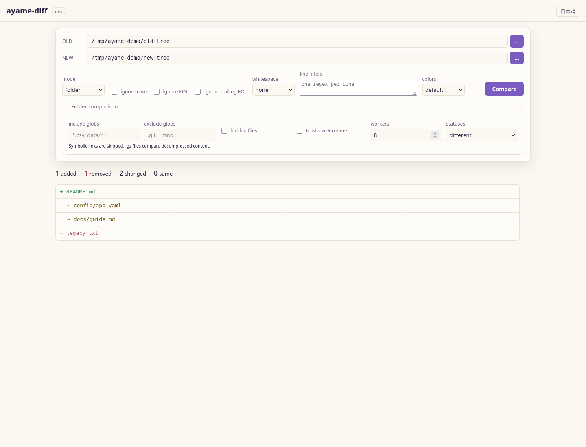
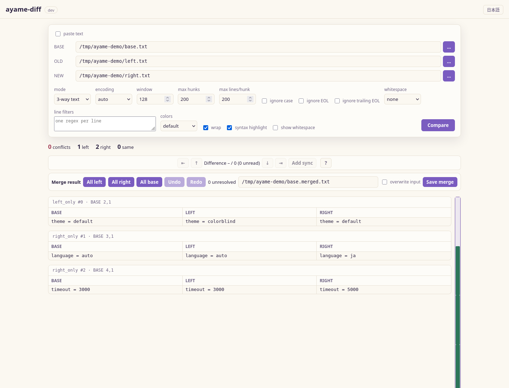

<!-- i18n: language-switcher -->
[English](gui.md) | [日本語](gui.ja.md)

# GUI

## スクリーンショット

| セットアップ | 左右差分 |
|---|---|
| [](assets/screenshot-setup.png) | [](assets/screenshot-diff.png) |

| フォルダ比較 | 3-way マージ |
|---|---|
| [](assets/screenshot-folder.png) | [](assets/screenshot-three-way.png) |

`ayame-diff`は、小さなローカルウェブアプリをバンドルしており、ターミナルの代わりにブラウザでファイルを比較できます。シングルページアプリはバイナリに埋め込まれているため、追加のインストールや外部ネットワークアクセスは必要ありません。

2つのサブコマンドで起動します：

- `serve` — 固定のアドレス（デフォルトはlocalhost）でサーバーを起動します。
- `gui` — 空いているlocalhostのポートでサーバーを起動し、ブラウザを開きます。

!!! warning "ローカル・シングルユーザー専用"
    サーバーはブラウザで入力したファイルパスを開くため、デフォルトでlocalhostにバインドされており、あくまでご自身のローカル環境での使用を想定しています。ネットワークに公開しないでください。

## `serve`

```text
ayame-diff serve [--addr host:port]
```

ウェブUIを起動し、`Ctrl+C`で停止するまで動作し続けます。

```bash
ayame-diff serve                       # http://127.0.0.1:8080
ayame-diff serve --addr 127.0.0.1:9000
```

| フラグ | デフォルト | 意味 |
|---|---|---|
| `--addr` | `127.0.0.1:8080` | 受信アドレス（`host:port`）。 |

## `gui`

```text
ayame-diff gui [--addr host:port] [--no-open]
```

`serve`と同じUIですが、空いているlocalhostのポートを選び、デフォルトのブラウザを起動します — ネイティブのWebView依存なしで「ダブルクリックしてGUIへ」体験を提供します。

```bash
ayame-diff gui             # 空いているポートを選び、ブラウザを開く
ayame-diff gui --no-open   # サーバーを起動するが、ブラウザは開かない
```

| フラグ | デフォルト | 意味 |
|---|---|---|
| `--addr` | `127.0.0.1:0` | 受信アドレス；ポート`0`は空いているポートを自動選択します。 |
| `--no-open` | オフ | サーバーを起動しますが、ブラウザは開きません。 |

## ウェブUIの使い方

**OLD**と**NEW**のファイルパス（またはサーバー側のファイルピッカーを使用）を入力し、モード（`text`、`sorted`、または`csv / tsv`）とオプション（エンコーディング、再同期ウィンドウ、ケース無視、空白文字処理、EOL制御、行ごとに入力する正規表現フィルター、`sorted`の場合は数値/逆順ソート）を選択して、**比較**をクリックします。結果は、行番号や単語レベルのハイライト付きのサイドバイサイドグリッドとして表示されます。**パッチ形式**（`normal`、`context`、`unified`）とコンテキスト行数を選び、**パッチのエクスポート**を使って適用可能な`ayame.patch`をダウンロードします。パッチのエクスポートはCRLFや最後の改行マーカーを保持し、バイナリやNUL入力は拒否します。エクスポートは`text`モードのみ対応；`sorted`ビューのパッチは安全に元のファイルに適用できません。

適用された無視設定は結果のサマリーに表示されます。これらはマッチングにのみ影響し、レンダリングされた行やエクスポートされたパッチは元のテキストを保持します。

### 差分のナビゲーション

スティッキーなナビゲーションバーは最初、前、次、最後のハンクにジャンプし、現在/合計、未読数を表示します。キーボードショートカットは`Alt+Down`、`Alt+Up`、`Alt+End`、`Alt+Home`です；`?`ボタンでUI内のこのリストを表示します。右側のロケーションバーはハンクのインデックスからマーカーを直接描画し、クリックでジャンプ可能、現在のビューポートを重ねて表示します。左右のテキストは縦横ともに同期されており、各ハンクは共有グリッドとスクロール行としてレンダリングされるため、2つの独立したペインではありません。

**動き検出**を有効にすると、正確な削除/挿入ブロックをペアリングします。移動したハンクは紫色の専用色と`↔`ボタンでペアの位置にジャンプします。検出はデフォルトでオフ；**最小移動行数**とエンジンの候補キャップにより、大規模比較の後処理が過剰にならないよう制御します。

### 手動による整列と無視差分

自動再同期が誤った行を選択した場合、両側の行を1つずつクリックし、**同期追加**を選択します。同期ポイントは差分を独立した区間に分割し、`OLD:NEW`のリムーバブルなチップとしてリストされ、即座に再計算されます。ポイントは両側とも増加する必要があり、APIとCLIは範囲と順序を検証します。CLIの同等コマンドは`--sync 100:120`のように1ベースの行番号を使用します。

各ハンクには**この差分を無視**もあります。無視されたハンクは折りたたまれた破線のヘッダーとして表示され、次/前のナビゲーションや未読数から除外され、復元も可能です。パッチエクスポートはこれらを省略し、`X-Ayame-Ignored-Hunks`レスポンスヘッダーに無視されたハンクの数を記録します。これにより、非表示の決定も監査可能です。永続的なルールには宣言的な行フィルター（#28）を使用してください。

### CSV / TSV設定とテーブル結果

`csv / tsv`を選択し、**ヘッダーの検査**をクリックします。サーバーは最初の論理レコードのみを読み取り、検出されたフォーマット/パーサと整列された列を報告します。検索可能な列リストは、すべての列、選択キー、除外キーのモードと、「すべて選択」「反転」をサポートします。パース設定、区切り文字、互換性、無視、許容範囲、リソース、一時ストレージ、出力設定も同じ画面で調整可能です；**設定の確認**は実行結果の概要を示します。

結果は100論理差分ごとにページ分割されます。変更されたセルだけが修正色で表示され、ヘッダーバッジは列ごとの変更数を示します。**変更された列のみ**は広い未変更列を隠します。サーバーはブラウザの応答を5,000論理差分に制限します；**実行とエクスポート**は完全なTSV（`_changed_cols`付き）またはJSON Lines形式の結果をローカルに保存します。

詳細は[旧TUIの整合性チェックリスト](gui-setup-parity.md)を参照してください。

### フォルダ比較

`folder`モードは、インクルード/エクスクルードグロブ、隠しファイルポリシー、並列ワーカー数、クイックサイズ+mtime比較を受け付けます。結果はステータスカラーのツリー構造で、ステータスフィルター付きのインデントされたツリーとして表示されます。変更されたファイルをクリックするとテキストモードに切り替わり、ペアの相対パスを開きます。シンボリックリンクはスキップされ、`.gz`ファイルは解凍内容と比較されます。

## HTTP API

GUIは小さなJSON APIを通じた薄いクライアントです。直接呼び出すことも可能です。

### `GET /`

埋め込み済みのシングルページアプリを提供します。

### `GET /api/health`

```json
{ "status": "ok", "version": "..." }
```

### `POST /api/diff`

リクエストボディ：

```json
{
  "old": "old.txt",
  "new": "new.txt",
  "mode": "text",
  "encoding": "auto",
  "window": 128,
  "maxHunks": 200,
  "maxLines": 200,
  "numeric": false,
  "reverse": false,
  "ignoreCase": false,
  "whitespace": "none"
}
```

| フィールド | 型 | 備考 |
|---|---|---|
| `old`, `new` | 文字列 | 比較するファイルパス。 |
| `mode` | 文字列 | `text`（デフォルト）または`sorted`。 |
| `encoding` | 文字列 | [`--encoding`](encoding.md)と同じ値。 |
| `window` | 数値 | 再同期ウィンドウ（0の場合は128のデフォルト）。 |
| `maxHunks` | 数値 | 返される最大ハンク数（0以下は200のデフォルト）。 |
| `maxLines` | 数値 | 1ハンクあたりの最大行数（0の場合は200のデフォルト）。 |
| `numeric`, `reverse` | ブール | ソート制御、`sorted`モード時に使用。 |
| `ignoreCase` | ブール | 比較時にケースを無視。 |
| `whitespace` | 文字列 | `none`、`change`、`all`のいずれか。 |
| `syncPoints` | 配列 | 0ベースの`{ "old": N, "new": N }`の強制対応点。 |
| `ignoredHunks` | 配列 | パッチ/レポート出力から除外されたハンクのインデックス。 |

成功時のレスポンス：

```json
{
  "old_lines": 120,
  "new_lines": 118,
  "hunks": [
    {
      "kind": "Replace",
      "old_start": 10,
      "old_len": 2,
      "new_start": 10,
      "new_len": 1,
      "old": ["行 a", "行 b"],
      "new": ["行 A"]
    }
  ],
  "hunk_count": 1,
  "omitted_hunks": 0,
  "added": 0,
  "deleted": 1,
  "modified": 1
}
```

各ハンクの`kind`は`Insert`、`Delete`、`Replace`のいずれかで、`old`/`new`配列に影響行が格納されます（`maxLines`により側ごとに制限）。移動検出を要求したもののハンク省略により完全な結果を出せない場合は、`move_detection_skipped: true`が追加されます。エラーはHTTP 4xxステータスとともにJSON本文で返されます。

```json
{ "error": "..." }
```

### リクエスト例

```bash
curl -s http://127.0.0.1:8080/api/diff \
  -H 'Content-Type: application/json' \
  -d '{"old":"old.txt","new":"new.txt","mode":"text","ignoreCase":true,"whitespace":"change"}'
```

### `POST /api/patch`

`/api/diff`と同じパス、インラインテキスト、モード、エンコーディング、比較フィールドを受け取り、追加で：

```json
{
  "old": "old.txt",
  "new": "new.txt",
  "patchFormat": "unified",
  "context": 3
}
```

レスポンスは`text/x-diff`で、`Content-Disposition: attachment`付きです。対応可能なフォーマットは`normal`、`context`、`unified`で、`context`は非負で省略時は3です。

### CSVとファイルAPI

- `GET /api/files?path=...`：ローカルディレクトリのエントリを最大2,000件リストアップ（設定ファイルピッカー用）。
- `POST /api/csv/inspect`：CSV設定JSONを受け取り、データ行をスキャンせずに最初のレコードのスキーマを検査。
- `POST /api/csv/diff`：完全な比較を実行し、ヘッダー、サマリー/ランキング、最大`maxRows`の論理JSONセル差分（デフォルトは`500`、最大`5,000`）を返す。
- `POST /api/csv/export`：同じリクエストに`output`、`outputFormat`（`tsv`または`jsonl`）、`outputHeader`を追加し、完全なローカル結果を書き出す。

これらのエンドポイントは意図的にローカルパスを受け付けており、GUIの他の部分と同じくlocalhost限定の警告が適用されます。
