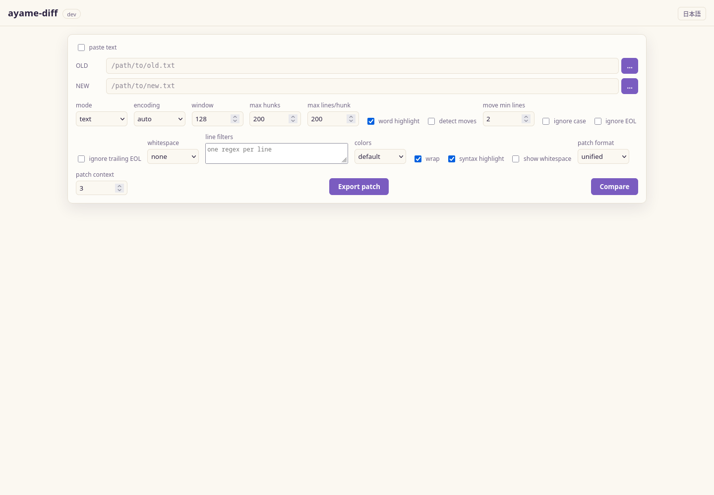

<!-- i18n: language-switcher -->
[English](gui.md) | [日本語](gui.ja.md)

# GUI

`ayame-diff` bundles a small local web app so you can compare files in the
browser instead of the terminal. The single-page app is embedded in the binary,
so there is nothing extra to install and no network access to the outside world.



*Paths are prominent before the first comparison; after that, editable sticky
pane headers replace the initial path rail.*

Two subcommands start it:

- `serve` — start the server on a fixed address (localhost by default).
- `gui` — start the server on a free localhost port and open your browser.

!!! warning "Local, single-user use only"
    The server opens the file paths you type in the browser, so it binds to
    localhost by default and is meant only for your own local use. Do not expose
    it to a network. A non-loopback `--addr` requires `--allow-remote` and
    prints a warning; anyone holding the URL can drive it, so place it behind
    trusted network access controls.

## Searching a result

`Ctrl+F` opens a search bar over the comparison result. Matches are highlighted
with a running count; `Enter` and `Shift+Enter` step forward and back, and `Esc`
closes. Toggles narrow it to changed lines only, make it case-sensitive, or
treat the query as a regular expression.

Matching runs against each line's whole text, so anchors (`$`) and patterns
spanning several syntax tokens work as written. The line-number gutter is not
searched, so a numeric query matches content rather than line numbers. The
number of highlighted matches is capped so a broad query on a very large diff
cannot undo the incremental rendering; the counter shows `+` when it applies.

## Access control

Every run generates an API token, and every `/api` call needs it in an
`X-Ayame-Token` header. The token rides in the URL that `gui` opens and `serve`
prints, and the page keeps it in `sessionStorage`, so an ordinary reload keeps
working. Open the printed URL — a bare `http://127.0.0.1:PORT/` in a fresh tab
has no token and the UI will say so.

Two properties follow from that design:

- **No CSRF.** A page on another site cannot set a custom header without a CORS
  preflight, which this server refuses. A cookie would have been attached
  automatically and would not have protected anything.
- **No DNS rebinding.** A loopback server also pins the `Host` header to the
  address it bound. A page that makes its own hostname resolve to `127.0.0.1`
  still sends that hostname in `Host`, and is refused — even with a valid token.

The embedded page, its assets, and `/api/health` stay open: the page cannot set
headers for its own sub-resources, and the launching command polls health for
readiness before any browser exists. Neither exposes user data.

A `--allow-remote` listener does not pin `Host`, because the names it is
reachable under cannot be known here. The token is the defense there.

## `serve`

```text
ayame-diff serve [--addr host:port] [--allow-remote]
```

Starts the web UI and keeps running until you use **Stop server** in the top bar
or stop it with `Ctrl+C`, `SIGINT`, or `SIGTERM`. Shutdown drains active HTTP
requests before the listener closes; requests that are only waiting — an
external-change watch, for example — are ended at once rather than held for
their full poll window, so a stop returns immediately.

```bash
ayame-diff serve                       # http://127.0.0.1:8080
ayame-diff serve --addr 127.0.0.1:9000
ayame-diff serve --addr 0.0.0.0:8080 --allow-remote
```

| Flag | Default | Meaning |
|---|---|---|
| `--addr` | `127.0.0.1:8080` | Listen address (`host:port`). |
| `--allow-remote` | off | Explicitly allow a non-loopback listen address. The API token still applies; the `Host` pin does not. |

If a requested fixed port is already in use, the command reports the conflict
and binds the next available port instead.

## `gui`

```text
ayame-diff gui [--addr host:port] [--allow-remote] [--no-open]
```

Same UI as `serve`, but it picks a free localhost port and launches your default
browser — the "double-click to a GUI" experience without a native webview
dependency.

```bash
ayame-diff gui             # pick a free port and open the browser
ayame-diff gui --no-open   # start the server but don't open a browser
```

| Flag | Default | Meaning |
|---|---|---|
| `--addr` | `127.0.0.1:0` | Listen address; port `0` picks a free port. |
| `--allow-remote` | off | Explicitly allow a non-loopback listen address. The API token still applies; the `Host` pin does not. |
| `--no-open` | off | Start the server but do not open the browser. |

An explicitly requested fixed GUI port uses the same next-port fallback;
the default port `0` already asks the operating system for a free port.

Each `gui` browser tab holds an authenticated lease. Closing the last tab
releases that lease and stops the server after a short reload grace period, so
a double-click launch does not leave an orphan process. A tab or browser that
crashes without sending its release expires after 90 seconds. With `--no-open`,
open the printed URL within 90 seconds. The explicit **Stop server** button
remains available in both `gui` and `serve`.

## Using the web UI

Enter the **LEFT** and **RIGHT** file paths (or use the server-side file picker),
choose the mode (`text`, `sorted`, or `csv / tsv`)
and options (encoding, resync window, ignore-case, whitespace handling, EOL
controls, repeatable regex filters entered one per line, and for
`sorted` the numeric/reverse sort), then **Compare**. The result is shown as a
side-by-side grid with per-hunk headers, line numbers and word-level
highlighting. **Syntax highlight** adds line-local coloring for common source,
data, markup, and log formats; the file extension selects the language and the
toggle is remembered in the browser. It operates only on rendered diff rows, so
it does not scan or retain the complete input file. Choose **patch format**
(`normal`, `context`, or `unified`) and a
context-line count, then use **Export patch** to download an applyable
`ayame.patch`. Patch export preserves CRLF and missing-final-newline markers and
rejects binary/NUL input. Export is available in `text` mode only; a patch of a
sorted view would not apply safely to the original file.

After a result appears, the initial path rail is removed from the work area.
Each sticky pane header identifies its side and carries an editable path, a
server-side browse button, detected encoding and line count where available.
Press `Enter` or leave an edited field to compare that replacement immediately;
the `⇄` control swaps LEFT and RIGHT. Re-comparison restores the logical line that
was in view rather than returning to the first difference.

### Progress and messages

A running comparison writes to its own progress line, and the outcome of an
operation — saved merge, exported patch, failed compare — joins a separate
message lane below it. Messages stack instead of replacing each other, so the
result of the previous attempt is still readable after the next one starts. A
success withdraws itself after a few seconds; a warning or a failure stays until
it is dismissed with its close button or with `Escape` while it holds focus. A
message that repeats is counted on its existing line rather than stacking a
duplicate, and each line carries the time it arrived.

### External changes

**Auto-reload external changes** is enabled by default in the View menu for
file-backed `text`, `sorted`, `csv / tsv`, and three-way comparisons. Saving a
compared file in another editor triggers one debounced re-comparison and keeps
the same logical row at the same screen offset. Atomic-save sequences and
several writes close together are coalesced before the comparison starts.

The browser uses authenticated `fetch` long polls, so the watch request carries
the same `X-Ayame-Token` as every other filesystem API. At most the three
BASE/LEFT/RIGHT paths are watched, and abandoned requests stop when the page,
paths, mode, or preference changes. If a future editable result has unsaved
changes, automatic replacement stops and a bar offers **Reload** or **Keep
current edits**.

Pasted text has no source file to watch. Folder comparison also stays manual:
recursively polling an arbitrarily large tree on every save would violate the
bounded-resource guarantees. Opening a changed folder entry as a text
comparison watches that file pair normally.

### Comparison URLs and browser history

After a successful file-backed comparison, the GUI stores the input paths,
mode, and comparison conditions in a versioned URL fragment. Reload restores
and re-runs that comparison. Comparing different inputs pushes a history entry,
while condition changes replace the current entry, so Back and Forward move
between complete comparison states.

The fragment is not sent to the server, but it does contain local paths.
**Copy link** in the result toolbar warns about that disclosure and copies a URL
with the API token removed. The copied URL grants no access by itself; open
ayame-diff normally first so the browser session has its own token.

Pasted scratch text is intentionally excluded. URL state is capped at 32 KiB;
use an `.ayamediff` project for very large CSV column selections.

Applied ignore settings are shown in the result summary. They affect matching
only: rendered lines and exported patches retain the original text.

Browser-dropped files are copied to a private local cache. Each file is limited
to 2 GiB and one browser session to 8 GiB; an oversized upload returns a clear
HTTP 413 error and its partial staged file is removed. Orphaned session caches
become eligible for cleanup after 24 hours when a later session starts.

### Navigating differences

The sticky navigation bar jumps to the first, previous, next, or last hunk and
shows the current/total and unread count. Keyboard shortcuts are `Alt+Down`,
`Alt+Up`, `Alt+End`, and `Alt+Home`; the `?` button shows this list in the UI.
The location bar on the right draws markers directly from hunk indexes, supports
click-to-jump, and overlays the current viewport. Left/right text stays vertically
and horizontally synchronized because each hunk is rendered as one shared grid
and scroll row rather than two independent panes.

Enable **detect moves** to pair exact deleted/inserted blocks. Moved hunks use a
dedicated purple color and an `↔` button jumps to the paired location. Detection
is off by default; **move min lines** and the engine candidate cap prevent the
optional post-processing pass from dominating huge comparisons.

### Manual alignment and ignored differences

When automatic resynchronization picks the wrong lines, click one line on each
side and choose **Add sync**. Sync points split the diff into independent
intervals, are listed as removable `LEFT:RIGHT` chips, and trigger an immediate
recalculation. Points must increase on both sides; the API and CLI validate
bounds and ordering. The CLI equivalent is repeatable `--sync 100:120` using
1-based line numbers.

Each hunk also has **Ignore this difference**. Ignored hunks remain visible as
collapsed dashed headers, are excluded from next/previous navigation and unread
counts, and can be restored. Patch export omits them and records the count in
the `X-Ayame-Ignored-Hunks` response header, so the hidden decision remains
auditable; use declarative line filters (#28) for a permanent rule.

### CSV / TSV setup and table result

Choose `csv / tsv`, then **Inspect headers**. The server reads only the first
logical record and reports detected format/parser and aligned columns. The
searchable column list supports all-column, selected-key, and excluded-key
modes plus Select all / Invert. Parsing, delimiter, compatibility, ignore,
tolerance, resource, temporary-storage, and output settings are available in
the same screen; **Review settings** summarizes the effective run.

The result is paged in groups of 100 logical differences. Changed cells alone
use the modification color, header badges show per-column change counts, and
**changed columns only** hides wide unchanged columns. The server caps the
browser response at 5,000 logical differences; **Run and export** writes the
complete TSV (with `_changed_cols`) or JSON Lines result to a local path.

See the [GUI reachability and placement policy](gui-setup-parity.md) for the
full mapping and the rules that keep advanced settings reachable without
promoting every engine option onto the result screen.

### Folder comparison

The `folder` mode accepts include/exclude globs, hidden-file policy, parallel
worker count, a five-way comparison method, named filter files/sets, and a
boolean metadata filter expression. **Preview filter** reports selected counts
and exposes a path sample before any content comparison. Folder settings can be
saved in a portable `.ayamediff.json` project. Results form an
indented, status-colored tree with status filters. Clicking a changed file
switches to text mode and opens the paired relative paths. Symbolic links are
skipped and `.gz` files compare decompressed content.

## HTTP API

The GUI is a thin client over a small JSON API. You can call it directly.

### `GET /`

Serves the embedded single-page app.

### `GET /api/health`

```json
{ "status": "ok", "version": "..." }
```

### `POST /api/diff`

Request body:

```json
{
  "old": "old.txt",
  "new": "new.txt",
  "mode": "text",
  "encoding": "auto",
  "window": 128,
  "maxHunks": 200,
  "maxLines": 200,
  "numeric": false,
  "reverse": false,
  "ignoreCase": false,
  "whitespace": "none"
}
```

| Field | Type | Notes |
|---|---|---|
| `old`, `new` | string | File paths to compare. |
| `mode` | string | `text` (default) or `sorted`. |
| `encoding` | string | Same values as [`--encoding`](encoding.md). |
| `window` | number | Resync window (default 128 when 0). |
| `maxHunks` | number | Max hunks returned (default 200 when ≤ 0). |
| `maxLines` | number | Max lines per hunk side (default 200 when 0). |
| `numeric`, `reverse` | bool | Sort controls, used when `mode` is `sorted`. |
| `ignoreCase` | bool | Ignore case when comparing. |
| `whitespace` | string | `none`, `change` or `all`. |
| `syncPoints` | array | 0-based `{ "old": N, "new": N }` forced correspondences. |
| `ignoredHunks` | array | Stored hunk indexes omitted from patch/report output. |

Success response:

```json
{
  "old_lines": 120,
  "new_lines": 118,
  "hunks": [
    {
      "kind": "Replace",
      "old_start": 10,
      "old_len": 2,
      "new_start": 10,
      "new_len": 1,
      "old": ["line a", "line b"],
      "new": ["line A"]
    }
  ],
  "hunk_count": 1,
  "omitted_hunks": 0,
  "added": 0,
  "deleted": 1,
  "modified": 1
}
```

Each hunk's `kind` is `Insert`, `Delete` or `Replace`, with `old`/`new` arrays
holding the affected lines (truncated to `maxLines` per side). The optional
`move_detection_skipped: true` field indicates that move detection was
requested but omitted hunks made a complete result impossible. Errors return
an HTTP 4xx status with a JSON body:

```json
{ "error": "..." }
```

### Example request

```bash
curl -s http://127.0.0.1:8080/api/diff \
  -H 'Content-Type: application/json' \
  -d '{"old":"old.txt","new":"new.txt","mode":"text","ignoreCase":true,"whitespace":"change"}'
```

### `POST /api/patch`

Accepts the same path, inline-text, mode, encoding and comparison fields as
`/api/diff`, plus:

```json
{
  "old": "old.txt",
  "new": "new.txt",
  "patchFormat": "unified",
  "context": 3
}
```

The response is `text/x-diff` with `Content-Disposition: attachment`. Valid
formats are `normal`, `context`, and `unified`; `context` is non-negative and
defaults to 3 when omitted.

### CSV and file APIs

- `GET /api/files?path=...` lists up to 2,000 local directory entries for the
  setup file picker.
- `POST /api/watch` accepts one to three file paths and an optional prior
  `baseline`. With no baseline it returns the current snapshot immediately;
  otherwise it waits up to 20 seconds and returns as soon as size, modified
  time, or mode changes. Re-submit the returned `snapshot` as the next
  baseline. Directories are rejected so one request cannot imply an unbounded
  recursive scan.
- `POST /api/csv/inspect` accepts CSV setup JSON and returns first-record schema
  inspection without scanning data rows.
- `POST /api/csv/diff` runs the complete comparison and returns headers,
  summary/ranking, and at most `maxRows` logical JSON cell differences (`500`
  by default, hard cap `5,000`).
- `POST /api/csv/export` uses the same request plus `output`, `outputFormat`
  (`tsv` or `jsonl`), and `outputHeader`, and writes the complete local result.

These endpoints deliberately accept local paths and are subject to the same
local-single-user and explicit remote-mode warnings as the rest of the GUI.
